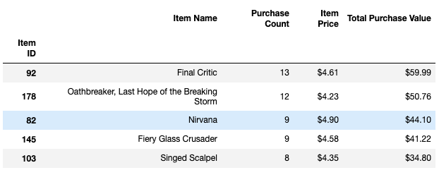
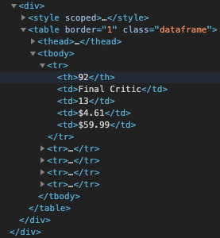

# Heroes of Pymoli


### Overview

The goal of this assignment was to apply the capabilities of Pandas to simplify the task of breaking down and analyzing a dataset. This particular dataset contains 780 rows, each representing an in-game purchase made by a player of **Heroes of Pymoli**, an otherwise free-to-play online game. The 7 columns include the details about the item purchased, as well as the user who purchased it:

User:

- Screen name
- Age
- Gender

Item:

- ID
- Name
- Price

The assignment can be broken down roughly into 3 main sections, by type of analysis required:

Headline numbers:

- Total number of unique players and items
- Total number of purchases and revenue
- Average item price

Gender and age range:

- Number of players per demographic and % of total
- Average of all purchases per demographic
- Average total amount spent per user, per demographic

Top 5:

- Spendiest players
- Most purchased items
- Most profitable items

Thankfully, with Pandas you can do this with very few lines of code using *Series*, *DataFrame* and *groupby*, which allow you to easily create, manipulate, and graphically represent fairly sophisticated matrices. You can start with a fairly messy CSV file, and in a few simple steps end up with a clean, well-structured table.

## The Jupyter Notebook UI

I mainly worked in the Jupyter Notebook browser UI, which lets you write and execute discrete segments of code and see the output in real time in the window. This includes displaying DataFrames as HTML tables:



There's also quite a bit of CSS happening. (You can't see the cursor in the screenshot, but that row is blue because there's a *:hover* effect.) All the styling comes from a single class called *dataframe*:



I assumed some Jupyter widget was compiling the HTML, but turns out it's actually the *to_html()* function on the DataFrame itself, which outputs an HTML string that Jupyter injects into the DOM as-is. So for fun, I decided to create a web page and do exactly the same thing. First thing I did was concatenate all the output of *to_html()* for every table. Then, to trick Python into writing JavaScript, I wrapped that in backticks and prepended *"let = content "*. Now we have a ready-to-inject JavaScript template literal, which looks something like this:

```
let text = `<div id="players" class="container table-container">
  <table border="1" class="dataframe">
    <thead>
      <tr style="text-align: right;">
        <th>Number of Players</th>
      </tr>
    </thead>
    <tbody>
      <tr>
        <td>576</td>
      </tr>
    </tbody>
  </table>
</div>`
```

As far as I can tell, Python won't open/write to a JS file, but thankfully the `<script>` tag isn't picky, it's perfectly happy to run JavaScript code from a TXT file. I created the *index.html* file, added some boilerplate, a jumbotron, and a target `<div>`, then 2 script tags: the first to run *output.txt*, and another to run *index.js*, which injects that *content* variable into the target `<div>` and does some more vanilla JS DOM manipulation to add some classes and `<h4>`s. Throw in Bootstrap and a *style.css*, spin up LiveServer, and you get this:


Obviously, that's pretty unnecessary and a bit outside of the scope of the assignment, but it gave me an excuse to make a GIF.

## Pandas

Back to the data analysis...

### Headline numbers

Getting the headline numbers was mostly a matter of grabbing data using a few Pandas functions:

- *nunique()* for player and item counts
- *count()* for total number of purchases
- *mean()* for average price
- *sum()* for total revenue 

I stored those expressions in a dictionary, then passed that to the *pandas.DataFrame* constructor - or, more specifically, the implementation of the constructor that takes in a dictionary. (There are many ways to create a DataFrame, but for single-row datasets like these, it seemed like the tidiest.)

### Groupby

The rest of the analysis relies heavily on the *DataFrame.groupby()* method, which takes in one of the column names and groups all the rows by unique values in that column. It's a complex data structure, and most of the struggles I had with this assignment were wrapping my head around what a *groupby* object actually is. One reason is that unlike *Series* and *DataFrame*, Pandas doesn't attempt to give you any sort of graphical representation, it just spits out the object reference.

I'll admit I still don't quite know how it works under the hood. It's a bit like a Rubik's cube, in that you don't need to be totally fluent in the nature of its 3-dimensional chess, you just need to figure out the basic tricks for manipulating it. It took hours and hours of playing around (and reading StackOverflow), but at some point it clicked and I was able to refactor some pretty procedural Python into fairly complex and elegant Pandas.

### Binning

One trick Pandas gives you is *binning*, which lets you classify your dataset based on numerical criteria. Normally you need at least 2 lines of code for each condition - ie, an *if*/*elif*/*else* statement and a code block - but with Pandas, you can just call the *cut()* method on a column and pass it a list of numerical range criteria, plus a list of labels for each slice, then save that as a new column in the DataFrame. This allowed me to demarcate every row into 8 age range bins with 3 lines of code, which would otherwise take upwards of 20.

### Map and format

One of the keys to making data human-readable is making sure it's in the correct format. For instance, much of the analysis in this assignment outputs prices, as well as a few percents. An easy way to do this is to call the *map()* method on a column, which performs the supplied callback function. You can write a custom lambda, but in this case we can pass the Python *format* method on a format string:

`generic_df["Some Column"] = generic_df["Some Column"].map("${:.2f}".format`

I got tired of doing that over and over, so I told Pandas to format every float as currency with 2 decimal points near the beginning:

`pd.options.display.float_format = '${:,.2f}'.format`

Now I only had to call *map()* twice to override that formatting for the percents in the gender and age demographics tables, and all the other floats became currency by default.

## Observable Trends

### Gender

While self-identified males account for 84% of all players and purchases, they're not the spendiest - that title goes to the 'Other / Non-Disclosed' group. While they account for only 2% of all players, they spend 11% more per item and 12% more overall. However, with a sample size of 11, we should probably avoid drawing any conclusions about their spending habits. We also don't how many are gender binary - ie, they are either male or female, but prefer not to identify - or gender non-conforming, so we shouldn't treat them as a monolithic group. That being said, I would advise the designers to make the game more inclusive to gender non-conforming players.

Female players also spent more than their male counterparts - 6% more per item and 10% more overall - and with a sample size of 81, it's safer to draw the conclusion that of the 2 gender-binary demographics, females buy more often and are more likely to go top shelf when they do. Therefore, I would encourage the design team to hire more female developers and game testers to make sure it doesn't put female gamers off with regressive gender tropes, and suggest that the marketing team target the female gamer community via their advertising and SEO/analytics.

The one area where males dominate is the Top Spenders chart. In fact, all of the top 5 spenders are male.

### Age

Of the age groups, the 20-24 group stands out as the most profitable, with 47% of total purchases. While their average purchase price is exactly average at $3.05, overall they spend almost 5% more than the average player. And similar to the male demographic, they dominate at the top: Only 1 player in the top 5 spenders is outside this demographic, but only by a year (25).

Only 2 other age groups spend more than average: The youngest (under 10) and the 2nd oldest (35-39). They're also the only groups that spend more per item than average, with the 35-39 group spending a whopping 18% more per item and 15% more in total. The lowest spenders are the 25-29 group, and we can see an upward trend as players enter their 30s, which could be a matter of disposable income (according to IRS data, the median income of a 30 year-old is 29% higher than a 25 year-old, and this rises a further 25% between the ages of 30 and 35). Game designers and marketing staff would be wise to target this early millenial demographic.

And while 20 year-olds make only half of what 25 year-olds make, they tend to have more financial support, fewer financial obligations, and are considerably less resonsible, which may be why they're more likely to drop $4.82 on a Fusion Pummel.

### Items

When it comes to the most popular items, it doesn't seem like price is the determining factor. The 3 most popular items - Final Critic, Oathbreaker, and Fiery Glass Crusader - skew heavily top-shelf. Why not introduce some higher-priced items and see how much players are willing to spend?